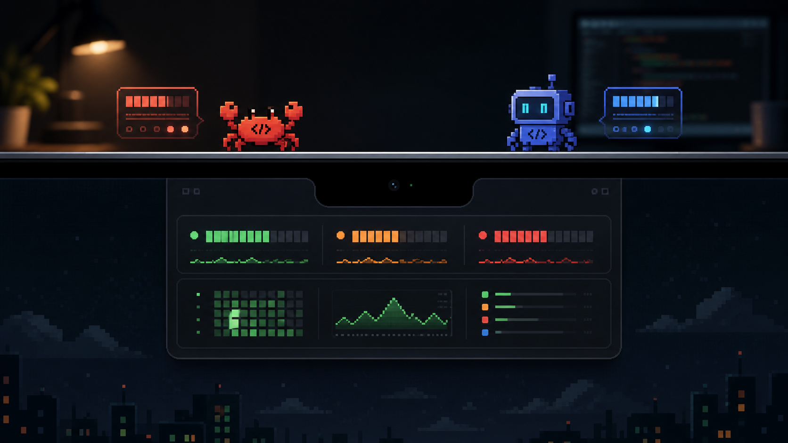
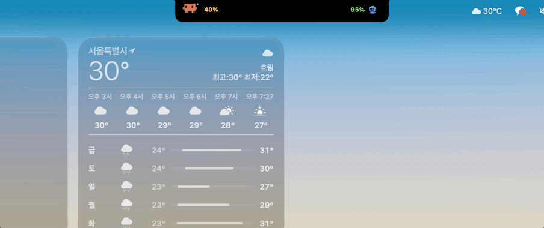
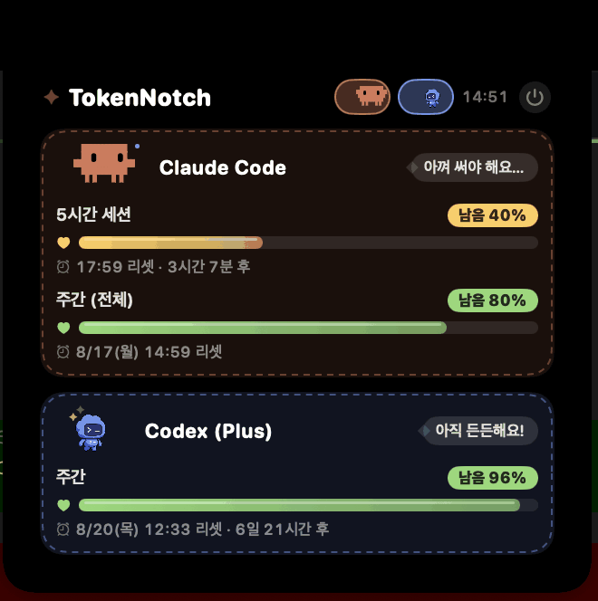
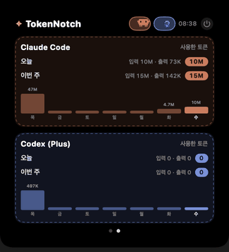

# TokenNotch

[한국어](README.md) | English

<p align="center">
  
</p>

A widget where **Clawd (Claude Code's official pixel crab)** and the **Codex pet (Codex CLI's official companion)**
live beside your MacBook notch, showing remaining usage and session reset times for Claude Code / Codex CLI.

<p align="center">
  
</p>

<p align="center">
  
  
</p>

- 🦀 **Left of the notch — Clawd**: a 1:1 reproduction of the official sprite embedded in the
  Claude Code CLI (quadrant block art, `clawd_body` color rgb(215,119,87), 4 poses).
  Patrols sideways and shows your remaining %
- 🤖 **Right of the notch — Codex pet**: "The original Codex companion", the CLI's flagship pet.
  The spritesheet is never bundled in this repo — it's downloaded at runtime from OpenAI's CDN
  and cached, exactly like Codex CLI itself does

---

## 1. Requirements

| Item | Condition |
|---|---|
| Hardware | A MacBook with a notch (Pro/Air 2021 or later) |
| OS | macOS 14 (Sonoma) or later |
| Build tools | Xcode or Xcode Command Line Tools (`xcode-select --install`) |
| Claude data | Logged in to Claude Code (Pro/Max subscription) |
| Codex data (optional) | Logged in to Codex CLI (ChatGPT Plus/Pro) |

> Using only one of the two is fine. You can hide the one you don't use
> (see [Visibility toggles](#4-visibility-toggles) below).

## 2. Install & run

```bash
git clone https://github.com/Borelchu/TokenNotch.git
cd TokenNotch

# Option A) Install as an app (recommended)
./install.sh                 # builds and creates dist/NotchUsage.app
open dist/NotchUsage.app     # run — characters appear beside the notch

# Option B) Also register it to launch at login
./install.sh --autostart

# Option C) Run directly for development
swift build && .build/debug/NotchUsage
```

On first launch it will:
- Read your Claude Code credentials from the keychain (choose **"Always Allow"** if prompted)
- Download the Codex pet spritesheet from OpenAI's CDN into `~/Library/Caches/NotchUsage/`
- Then poll both providers' official usage APIs every 5 minutes

There is no Dock icon and no menu bar icon. It lives only beside the notch.

The UI language follows your macOS system language (Korean / English).

## 3. Reading the display

### Compact (always visible)

```
  🦀 72%     [ notch ]     96% 🤖
```

- Number = **remaining quota for the 5-hour session** (or the weekly window if your Codex plan only has that)
- Color = green (>50%) / yellow (20–50%) / red (<20%)
- The characters' behavior also tells you the state:

| Remaining | Clawd | Codex pet |
|---|---|---|
| Over 50% | Relaxed sideways patrol, arms up at turnarounds | Running happily |
| 20–50% | Hurried steps, sweating | Typing frantically on a laptop + sweat |
| Under 20% | Panic dash, flailing arms, bouncing | Sad face (x_x), trembling |
| Error / expired token | Asleep, zzz | Asleep, zzz |

### Expanded view (hover over the notch)

- Per-provider cards with **HP bars** (the filled part is what you have left) and remaining-% badges
- ⏰ Reset time + countdown (e.g. `resets 18:00 · in 2h 25m`)
- Claude shows 5-hour session / weekly (all·Opus·Sonnet); Codex shows whatever windows your plan provides
- Character speech bubbles: "Plenty left!" → "Getting low…" → "Almost out!!" → "Napping… zzz"
- The ⏻ button at the top right quits the app
- **Swipe sideways (or click the dots below) for page 2 = token stats**: per provider,
  tokens used today / this week (input·output split) and a 7-day bar chart.
  The usage API only exposes percentages, so absolute counts are aggregated from the
  CLIs' local logs (`~/.claude/projects/**.jsonl`, `~/.codex/sessions/**`) — only for
  as long as the logs are kept locally (Claude Code keeps 30 days by default)

## 4. Visibility toggles

Click the **character face chips** on the right side of the expanded header to toggle each provider.

- A hidden provider disappears from both the expanded view and the compact display beside the notch
- Disabled chips turn grayscale and dim
- The setting is saved automatically and survives restarts (`showClaude`/`showCodex` in the `defaults` domain)
- You can't turn both off — disabling the last one automatically re-enables the other

## 5. Where the data comes from

| | Auth | Endpoint | What the numbers mean |
|---|---|---|---|
| Claude Code | OAuth token from the macOS keychain (`Claude Code-credentials`) | `api.anthropic.com/api/oauth/usage` | Same official numbers as the `/usage` command |
| Codex CLI | access_token + account_id from `~/.codex/auth.json` | `chatgpt.com/backend-api/wham/usage` | Same official numbers as the `/status` command |

- **5-minute polling**: the Claude usage endpoint returns a sticky (~10 min) 429 if you call it
  without a CLI User-Agent or too frequently, so we poll every 5 minutes with a 15-minute cooldown after a 429.
- **No token refreshing**: when a token expires the card tells you, and running the CLI
  (`claude` or `codex`) once refreshes it automatically. Codex refresh tokens in particular are
  single-use — refreshing from the widget could break your CLI login, so this app is deliberately read-only.
- Codex session/weekly windows are classified by `limit_window_seconds`, not position
  (Plus plans sometimes report only a weekly window).

## 6. Troubleshooting

| Symptom | Cause / fix |
|---|---|
| Clawd sleeps with "Couldn't find Claude Code credentials…" | Make sure you're logged in to Claude Code (`claude` → `/login`) |
| "Keychain access was denied" | Click "Always Allow" in the dialog. Dev builds re-prompt after each rebuild since the signature changes |
| "Token expired" | Run `claude` (or `codex`) once in a terminal to auto-refresh |
| "API error (HTTP 429)" | Temporary rate limit. Last data is kept and it retries after 15 minutes |
| Codex pet shows as a stand-in robot | The official sprite replaces it on the next launch once the download succeeds |
| Characters misplaced / not visible | Compact mode isn't supported when a notch-less external display is primary. Check on the built-in display |
| Numbers show `—` | First fetch hasn't happened yet, or your plan doesn't have that window (e.g. Codex 5-hour) |

If you need logs, run it directly in a terminal:

```bash
.build/debug/NotchUsage
# prints lines like: NotchUsage claude: 5h 46.0% used ...
```

## 7. Quit / uninstall

```bash
# Quit: the ⏻ button in the expanded view, or
pkill -x NotchUsage

# Remove autostart
launchctl unload ~/Library/LaunchAgents/local.notchusage.plist
rm ~/Library/LaunchAgents/local.notchusage.plist

# Full removal
rm -rf dist ~/Library/Caches/NotchUsage
```

## 8. Project layout

- `Sources/NotchUsage/main.swift` — app entry point (accessory app, no Dock icon)
- `Sources/NotchUsage/AppDelegate.swift` — DynamicNotch setup, hover expand/collapse, 5-minute poll loop
- `Sources/NotchUsage/UsageModel.swift` — Claude keychain / Codex auth.json reading, usage API calls, state model
- `Sources/NotchUsage/Characters.swift` — official Clawd sprite renderer (+ Codex fallback robot)
- `Sources/NotchUsage/CodexPet.swift` — official Codex pet spritesheet loader/animator
- `Sources/NotchUsage/TokenStats.swift` — daily token totals aggregated from the CLIs' local logs
- `Sources/NotchUsage/L10n.swift` — Korean/English strings, picked from the system language
- `Sources/NotchUsage/Views.swift` — compact/expanded SwiftUI views, visibility toggles, HP bars
- `install.sh` — release build → .app bundle (+ `--autostart` registers a LaunchAgent)

Built on [DynamicNotchKit](https://github.com/MrKai77/DynamicNotchKit) (MIT); the concept and
polling policy follow [CodexIsland](https://github.com/ericjypark/codex-island).

> ⚠️ The Clawd and Codex pet artwork are the IP of Anthropic and OpenAI respectively.
> This is a personal widget and redistributes no assets
> (Clawd is reproduced in code; the Codex pet is downloaded at runtime from the official CDN).
